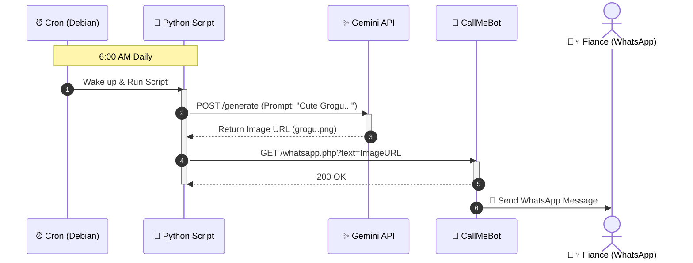

```mermaid
sequenceDiagram
    autonumber
    participant C as ⏰ Cron (Debian)
    participant S as 🐍 Python Script
    participant G as ✨ Gemini API
    participant B as 🤖 CallMeBot
    actor U as 👱‍♀️ Fiance (WhatsApp)

    Note over C,S: 6:00 AM Daily
    C->>S: Wake up & Run Script
    activate S
    
    S->>G: POST /generate (Prompt: "Cute Grogu...")
    activate G
    G-->>S: Return Image URL (grogu.png)
    deactivate G

    S->>B: GET /whatsapp.php?text=ImageURL
    activate B
    B-->>S: 200 OK
    deactivate B
    deactivate S

    B->>U: 🔔 Send WhatsApp Message
```
