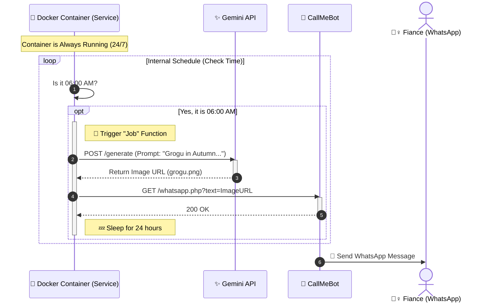

```mermaid
sequenceDiagram
autonumber
participant D as 🐳 Docker Container (Service)
participant G as ✨ Gemini API
participant B as 🤖 CallMeBot
actor U as 👱‍♀️ Fiance (WhatsApp)

    Note over D: Container is Always Running (24/7)

    loop Internal Schedule (Check Time)
        D->>D: Is it 06:00 AM?
        opt Yes, it is 06:00 AM
            activate D
            Note right of D: 🚀 Trigger "Job" Function

            D->>G: POST /generate (Prompt: "Grogu in Autumn...")
            activate G
            G-->>D: Return Image URL (grogu.png)
            deactivate G

            D->>B: GET /whatsapp.php?text=ImageURL
            activate B
            B-->>D: 200 OK
            deactivate B

            Note right of D: 💤 Sleep for 24 hours
            deactivate D
        end
    end

    B->>U: 🔔 Send WhatsApp Message
```
