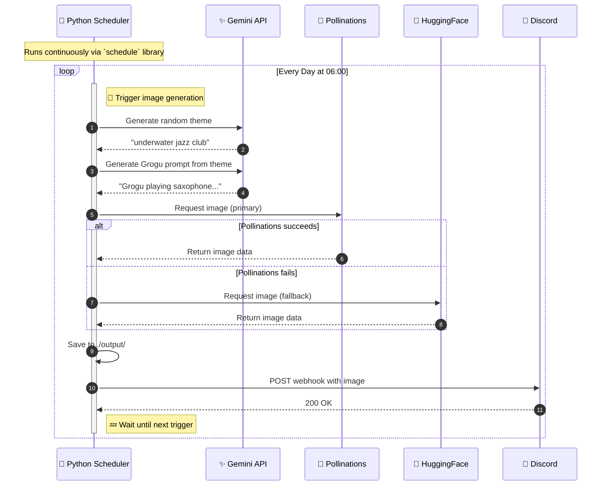

```mermaid
sequenceDiagram
    autonumber
    participant S as 🐍 Python Scheduler
    participant G as ✨ Gemini API
    participant P as 🎨 Pollinations
    participant H as 🤗 HuggingFace
    participant D as 💬 Discord

    Note over S: Runs continuously via `schedule` library

    loop Every Day at 06:00
        activate S
        Note right of S: 🚀 Trigger image generation

        S->>G: Generate random theme
        G-->>S: "underwater jazz club"

        S->>G: Generate Grogu prompt from theme
        G-->>S: "Grogu playing saxophone..."

        S->>P: Request image (primary)
        alt Pollinations succeeds
            P-->>S: Return image data
        else Pollinations fails
            S->>H: Request image (fallback)
            H-->>S: Return image data
        end

        S->>S: Save to ./output/

        S->>D: POST webhook with image
        D-->>S: 200 OK

        Note right of S: 💤 Wait until next trigger
        deactivate S
    end
```
